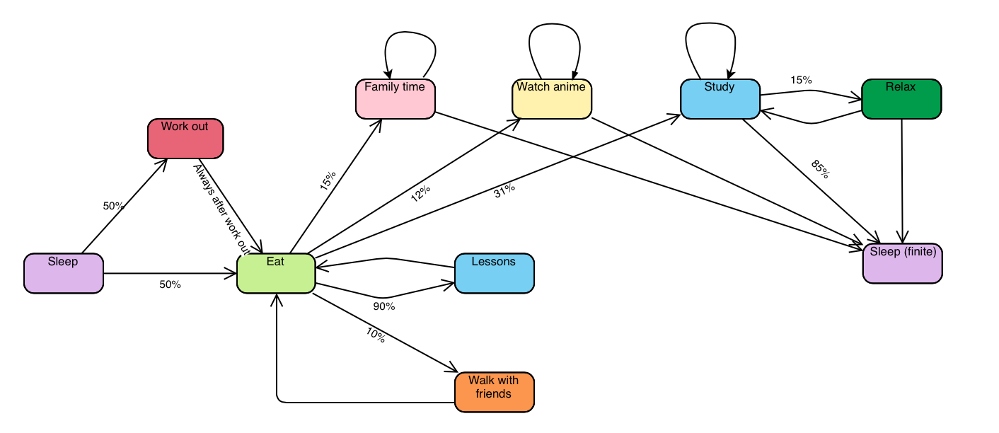

<!-- PROJECT LOGO -->
 

 

  <h3 align="center">Laboratory Work №3</h3>

  

    <h4>Discrete math</h4>

<!-- ABOUT THE PROJECT -->
## About The Project

This project is about representing your own day using Finite State Machines.
I started with creating an FSM model to make a strcuture of future code and make it more clear to implement.

Here we can see day description. Day could contain work out or not, but breakfast is mandatory. After that i study most of time, but if amount of deadlines is not worthy no worries, i could have a walk with friends. During studies i usually have a lunch and after few hours i go home. There i could spent time with family or watch anime, but, as i said, i study most of the time. When i am ran out of energy day is over and i go to sleep.

<!-- GETTING STARTED -->
## Getting Started

To try this code you can open **day_simulation.py** file and uncomment an example. 
If you wanna try it by your example you need to create your own student and start execution by **start_simulation()** method in DaySimulation class.
You create a object of it or use already creted one.

<!-- USAGE EXAMPLES -->
## Usage examples

Here you can see some execution examples.

1.
Good morning, day is started.

Mariia is working out now.

Current situation is: 

Time: 8 

State: Work Out 

Mood: great 

Energy: 90 

Hunger: 100 

Stress: 10

After work out body needs resources, heading to kitchen.

Current situation is: 

Time: 9 

State: Eat 

Mood: great 

Energy: 90 

Hunger: 0 

Stress: 10

Lessons and studies is not today`s goal, we are meeting friends.

Current situation is: 

Time: 11 

State: Walk with friends 

Mood: great 

Energy: 70 

Hunger: 50 

Stress: 10

Walking with friends is nice, but food is better.

Current situation is: 

Time: 12 

State: Eat 

Mood: great 

Energy: 70 

Hunger: 0 

Stress: 10

Today Mariia need to submit some deadlines to sleep at night.

Current situation is: 

Time: 16 

State: Study 

Mood: bad 

Energy: 50 

Hunger: 100 

Stress: 10

Mariia is exhausted with studing and ready to sleep.

Current situation is: 

Time: 24 

State: Good night 

Mood: good 

Energy: 0 

Hunger: 0 

Stress: 10

Current situation is: 

Time: 24 

State: Good night 

Mood: good 

Energy: 0 

Hunger: 0 

Stress: 10

Mariia is ran out of resources, so day is over)

2.

Good morning, day is started.

Mariia is working out now.

Current situation is: 

Time: 9 

State: Work Out 

Mood: great 

Energy: 40 

Hunger: 100 

Stress: 50

After work out body needs resources, heading to kitchen.

Current situation is: 

Time: 10 

State: Eat 

Mood: great 

Energy: 40 

Hunger: 0 

Stress: 50

Today Mariia has some lessons to attend.

Current situation is: 

Time: 14 

State: Lessons 

Mood: good 

Energy: 20 

Hunger: 100 

Stress: 50

Mariia need to restore resources, food resources.

Current situation is: 

Time: 15 

State: Eat 

Mood: great 

Energy: 20 

Hunger: 0 

Stress: 50

Today Mariia need to submit some deadlines to sleep at night.

Current situation is: 

Time: 19 

State: Study 

Mood: bad 

Energy: 0 

Hunger: 100 

Stress: 50

Current situation is: 

Time: 19 

State: Study 

Mood: bad 

Energy: 0 

Hunger: 100 

Stress: 50

Mariia is ran out of resources, so day is over)

<!-- FUN FACT -->
## Fun Fact

Creature at the top of the project is also FSM.
Because it is Flying Spageetti Monster --> FSM.
I thought it is funny :)

<!-- LICENSE -->
## License

Distributed under the MIT License. See `LICENSE.txt` for more information.
